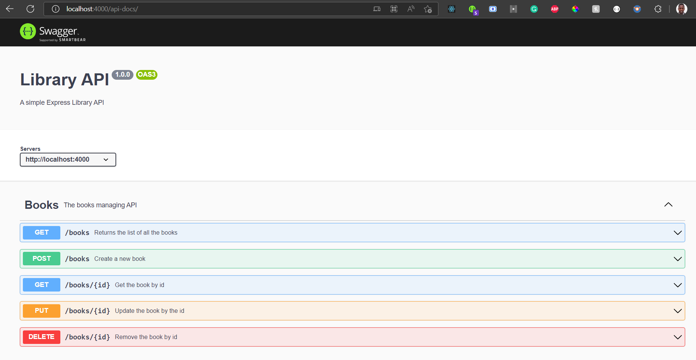

### swagger-api-library
- This is a book API demonstrating the use of Swagger UI and Jsdocs to document your built public APIs that are easily readable and accessible to people consuming it

## Technologies used
- Express
- rowdb
- morgan
- nodejs
- cors
- swagger-jsdoc
- swagger-ui-express
- nanoid

## Installation procedure
- To Install this application you need node js(latest)
- In your terminal use either yarn `yarn install`or npm `npm install` to install your dependencies
- After installing dependencies you are free to go
- Launch the app using `node index.js`
- To view it on your browser got to [http://localhost400/](http://localhost:4000/api-docs/)
- Here's an image of the API documentation in action:
   
Move along.😎

## Author
  [Cliff Gor](https://cliffgor.com/)

  ## Challenges

  - I had a challenge with lowdb where it was configuring the whole code as es6
  - I used an older version of dependancies due to code breaking.

## Achievements
- Was able to make the API work by using older versions of the packages